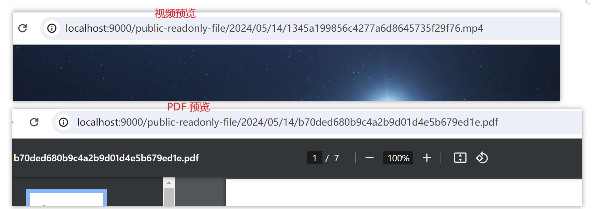
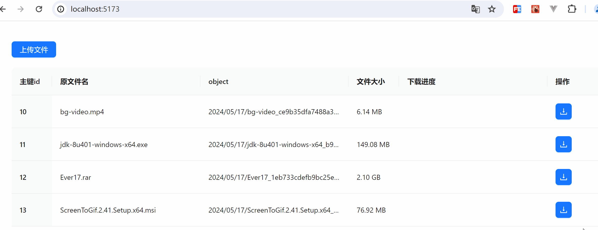

# 项目技术

- 前端React：React + TypeScript + antd + axios + ahooks
- 前端Vue：vue@3.4 + TypeScript + arco design vue + axios
- 后端：SpringBoot3.x + Redis + minio + lombok + MybatisPlus

以上框架和技术均为最新的版本，旧版本需自行查看相关变动

> - 两个前端项目的逻辑代码基本一致，为适配两个框架不同组件库的组件，可能会有极细微的差异，可忽略不计
> - vue 项目使用 vue3 setup 语法糖 与 vue2 差异较大，暂未提供 vue2 版本，语法差异自行处理。

# 预览图

## 上传文件功能预览

展示及请求

前端控制台

浏览器可支持的文件预览

目录结构

## 下载文件功能预览

下载及暂停操作展示

下载内容展示

> 上传时通过 `p-limit` 限制了上传的并发请求。
> 下载由于有暂停操作，需要循环过程中中止，一旦使用 `p-limit`，暂时没有想到两者结合的完美暂停方案，因此并未对下载做并发限制，欢迎 PR。

# 注意事项

## Woker 线程注意事项

- 前端采用多线程计算分片 md5，然后使用 **MerkleTree** 计算文件的 hash。相较于单线程计算 md5，会节省 70% ~ 80% 的时间 

优化前，一个 2.1G 的文件上传耗时 18s

优化后仅 2 s

### 缺陷

- 由于 MerkleTree 是采用每个分片的叶子节点进行计算，而分片大小会影响分片的 md5，进而影响整个文件的树根节点 hash，所以**不能随意变动分片大小，否则 MerkleTree 计算出来的 md5 将会改变，后台将会重新识别为一个新文件进行上传**

## minio 注意事项

- minio 开启了公共只读策略，所以不需要进行签名访问
- 如何开启 minio 公共只读策略？**见 service 文件夹（后端）的测试类 `ReactMinioSpringApplicationTests`**

# 文件磁盘缓存问题

目前刷新网页是不会留存已下载文件的分片数据的，目前若想边下载边缓存，类似网盘下载的方式，有以下几种思路实现。

- IndexDB 存储：可以长期留存在浏览器内存中，实现刷新甚至关闭网页，已下载文件不会丢失的情况。
  - 缺点：IndexDB 的存入速度较慢，在分片下载情况下，同步存储 IndexDB，会导致下载时长高出一倍以上，且文件的存储大小可能会影响浏览器的运行。
- FileSystem API 存储：可以让浏览器直接调用文件夹的权限实现读写。
  - 缺点：交互性并不好，且 API 兼容性很差。一次性写入可实现，分片写入和读取的能力暂未尝试，但是有可探索空间。
- Electron 客户端：可直接操作 node 实现文件的读写存储，理想情况下是最佳方式。